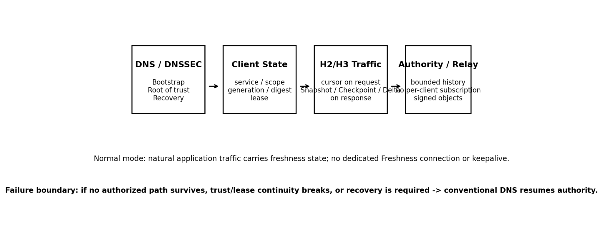
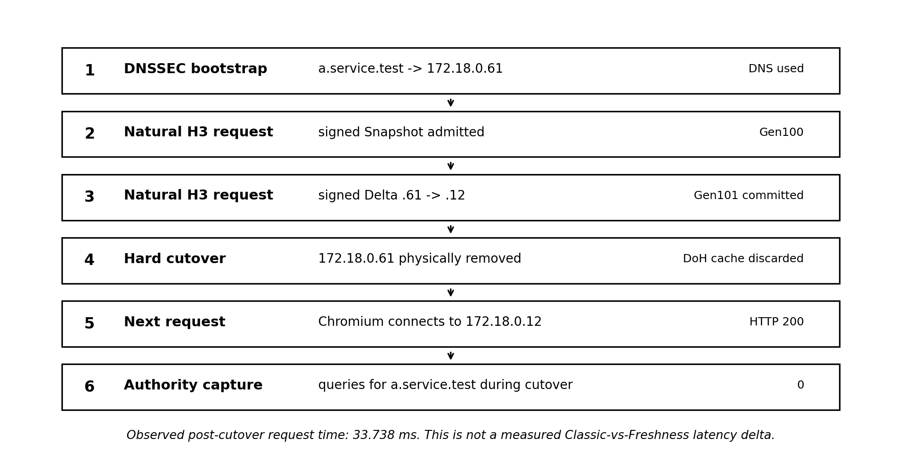
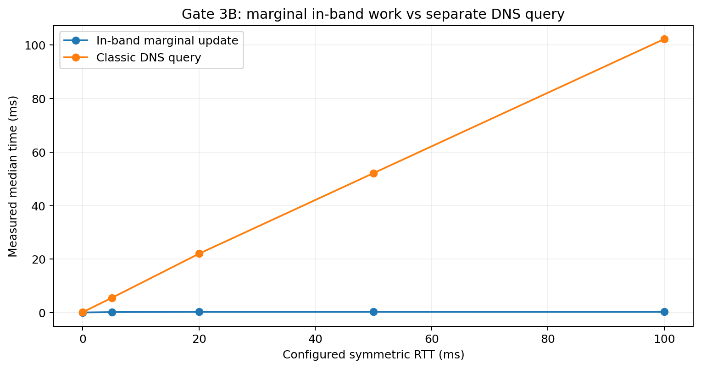

# Opportunistic In-Band DNS Freshness

[](https://doi.org/10.5281/zenodo.22120931)

**Experimental DNS freshness protocol: DNSSEC-authorized, versioned reconciliation of DNS-derived service state over existing application traffic, without a dedicated update channel.**

This repository publishes a protocol design, a patched Chromium proof of concept, frozen experimental evidence, deterministic test vectors, and clean reconstruction helpers so that other networking engineers can reproduce the result, stress the assumptions, and try to break the design.

> **Status: experimental research / PoC, v0.1.0. Not a standard and not production-ready.**

## The idea

Classic DNS freshness is primarily timer-driven. DNS Push can provide asynchronous updates, but requires a separate update relationship. This project explores a third operating point for **already-active services**:

1. DNS/DNSSEC performs bootstrap, view admission, and root-of-trust establishment.
2. The client maintains a bounded, versioned state for the active service/scope.
3. Natural HTTP requests carry a compact cursor describing the client's current state.
4. Natural HTTP responses may carry an independently verifiable, Authority-signed `Snapshot`, `Checkpoint`, `Delta`, or `ResyncRequired` object.
5. If ancestry, trust, lease, or reachability assumptions fail, conventional DNS resumes authority.

The application path is the **carrier**, not the source of authority.


### TTL and connection-lifetime clarification

**After successful Freshness admission, the original DNS TTL is no longer the recurring freshness timer for that admitted state.** A verified signed `Snapshot`, `Delta`, or `Checkpoint` is a new Authority-authorized freshness statement with its own bounded validity interval. While that Freshness validity remains active, the admitted state may remain usable even if the TTL from the original DNS bootstrap would otherwise have expired. When the Freshness validity expires, conventional DNS/cache policy resumes authority.

The mechanism is also **not tied to keeping one particular HTTP/2 or HTTP/3 transport connection alive**. Its intended condition is broader: the service remains actively used and at least one authorized application path survives long enough for a natural request/response exchange to carry a newer signed state. If no authorized path survives, or trust/ancestry/lease validity is lost, the client returns to DNS.



## What is actually new here?

This work does **not** claim that advertising a future endpoint over an existing connection is new; HTTP Alt-Svc already occupies that design space. It also does **not** claim that carrying DNSSEC-validatable material in-band is new; RFC 9102 is close prior art in the DANE/TLSA handshake context.

The contribution under test is the combined **DNS-derived state-reconciliation model**:

- DNSSEC-rooted admission and emergency reset;
- bounded `service_id` / `scope_id` state;
- `(root_epoch, generation, state_digest)` identity;
- exact Delta ancestry;
- fork and history-gap detection;
- bounded leases;
- positive, NODATA, and NXDOMAIN state;
- eviction and re-admission semantics;
- scope-wide repair over any surviving authorized application path;
- safe fallback to DNS.

In short: **state reconciliation, not endpoint advertisement**.

## Strongest demonstrated result

The canonical Chromium/H3 hard-cutover experiment performed this sequence:

1. Chromium bootstrapped `a.service.test` through Secure DoH backed by a DNSSEC-validating resolver.
2. A signed Snapshot established Gen100 pointing to `172.18.0.61`.
3. A later natural H3 response carried a signed Delta Gen100 -> Gen101 changing the endpoint to `172.18.0.12`.
4. Gen101 was committed **before** cutover.
5. The resolver cache was discarded.
6. The old endpoint `172.18.0.61` was physically removed.
7. The same Chromium process issued the next request.
8. Chromium used `172.18.0.12` and received HTTP 200.
9. The authoritative DNS capture observed **0 queries for `a.service.test` during the cutover**.



Supported claim:

> In this local Chromium lab, a DNSSEC-authenticated Freshness scope was updated over natural HTTP/3 traffic; after a hard endpoint cutover, Chromium used the Freshness-updated endpoint without re-resolving the target name through DNS.

The observed post-cutover request time was 33.738 ms. That value is **not** a measured Classic-DNS-vs-Freshness latency delta.


## Post-v0.1 Alt-Svc stale-state falsification result

A follow-up Chromium/HTTP/3 falsification test on 27 August 2026 exercised stale-state handling against Alt-Svc and the Freshness implementation.

**C1 — Chromium Alt-Svc response reordering**

- a test-designated newer Alt-Svc advertisement for port `4555` was sent first;
- a deliberately delayed older advertisement for port `4444` arrived later;
- after both responses completed and a fresh routing decision was forced, the next probe used port `4444`;
- the same outcome was observed twice in the local lab.

**C2 — native Chromium Freshness stale replay**

- Snapshot Gen100 was admitted;
- Delta Gen100 -> Gen101 was verified and committed;
- the older Gen100 -> Gen101 Delta was delivered again while local state was already Gen101;
- Chromium logged `STALE_DELTA=IGNORE LOCAL_GEN=101 FROM_GEN=100` and preserved the committed newer state.

Supported comparative claim:

> In these controlled Chromium/HTTP/3 tests, Alt-Svc was observed to regress to a later-arriving stale alternative, while Opportunistic Freshness rejected stale generation ancestry and preserved the newer committed state.

This is a **stale-state protection result**, not a claim of universal superiority, production prevalence, or Internet-scale behavior. See [the post-v0.1 falsification note](docs/altsvc-reordering-falsification-2026-08-27.md).

Local freeze identifier: `20260827T055217Z`  
Freeze root SHA-256: `caccf4d38bb4f2dac7d5e62db60c299314b6a08f902e18a262ac45044753f9dc`

## Performance evidence

### RTT experiment: marginal in-band work vs a separate DNS transaction

Gate 3B used symmetric netem RTT and measured the marginal in-band update path against a separate DNS query path:

| Configured RTT | In-band marginal median | Separate DNS median |
|---:|---:|---:|
| 0 ms | 0.094 ms | 0.242 ms |
| 5 ms | 0.232 ms | 5.560 ms |
| 20 ms | 0.324 ms | 22.064 ms |
| 50 ms | 0.336 ms | 52.145 ms |
| 100 ms | 0.312 ms | 102.203 ms |



Interpretation: the experiment demonstrates the **mechanism-level opportunity**. Reconciliation can be folded into an application exchange that is already paying the path RTT, whereas a separate DNS transaction remains an RTT-bearing network transaction. This table is **not** evidence that "Freshness is 300x faster than DNS" for complete end-to-end browser workloads.

### Chromium/H3 paired request benchmark

100 paired repetitions compared a response carrying a Delta against a NoChange response on the same application QUIC connection:

| Metric | Delta | NoChange |
|---|---:|---:|
| Mean | 29.374 ms | 29.251 ms |
| p50 | 29.378 ms | 28.997 ms |
| p95 | 32.720 ms | 33.315 ms |
| p99 | 34.717 ms | 34.505 ms |

Paired Delta - NoChange mean: **+0.123 ms**.

Safe interpretation:

> **No material per-request penalty was detected at the resolution of this harness.**

The +0.123 ms value is a descriptive point estimate, not a statistically resolved universal protocol overhead.

### H3 wire observation

One paired H3/QUIC capture observed:

- Delta: 733 B UDP payload total;
- NoChange: 495 B UDP payload total;
- observed difference: +238 B UDP / approximately +182 B at the reported L3 accounting.

This is an **n=1 trace-specific observation**, not a protocol constant. The deterministic fullstack Delta COSE object size (273 B in the current fullstack vector) is the stronger object-level size fact.

## Where this may be useful

The intended operating point is an active service where at least one authorized application path survives long enough to carry a newer state before or during a topology change. Examples worth testing include:

- CDN / edge rotation and draining;
- rolling and blue/green deployments;
- multi-region active/active service changes;
- multi-endpoint A/AAAA/SVCB state that should change coherently;
- high-RTT environments where avoiding an additional refresh transaction may matter;
- large active client populations where population-wide DNS refresh work may be reduced.

The last point is a hypothesis for external measurement, not a result already proven by the local lab.

## Where it is not a replacement

- **Cold start:** DNS remains the bootstrap path.
- **No surviving authorized path:** DNS recovery is required.
- **Application silence with an immediate update requirement:** DNS Push can serve an operating point this base design deliberately does not cover.
- **Trust loss, lease expiry, fork, or unbridgeable history gap:** fail safe to DNS/re-admission.

This project does not claim that DNS is replaced or that TTLs disappear universally.

## Repository map

```text
.
├── README.md
├── CITATION.cff
├── AUTHORS.md
├── LICENSE
├── LICENSES.md
├── NOTICE.md
├── PROVENANCE.md
├── FALSIFICATION.md
├── RELEASE_SHA256SUMS
├── docs/
│   ├── technical-report.pdf
│   ├── technical-report.docx
│   ├── protocol-spec.md
│   ├── evidence-freeze-v0.1-de.md
│   ├── freeze-manifest-v0.1.json
│   └── diagrams/
├── implementation/
│   ├── chromium-freshness-v0.1.patch
│   ├── chromium-base-revision.txt
│   └── chromium-build-args.gn
├── reproduction/hard-cutover/
├── evidence/
│   ├── hard-cutover/
│   ├── browser-freshness-100/
│   └── wire-delta-nochange/
└── test-vectors/gate13/
```

## Reproduce and inspect

Start with [`reproduction/hard-cutover/README.md`](reproduction/hard-cutover/README.md).

The public implementation is pinned to Chromium revision:

```text
782af9cb30a53f54487e5d2e44738645a8ec457c
```

Tested Chromium version: `151.0.7922.34`.

The repository intentionally does **not** distribute a Chromium binary or historical private keys. Reproduction helpers generate fresh test-only authority, DNSSEC, and TLS key material locally.

Important evidence distinction:

- `evidence/` contains the **frozen validated experimental runs** used for the report.
- `reproduction/` contains **clean reconstruction tools** for independent testing.
- The clean key/discovery/DNSSEC/vector helpers were validated, but the entire clean reproduction path has not been independently re-run end-to-end as a single packaged runner. Do not treat that as a claim the repository makes.

## Try to break it

The goal of this release is external falsification, not another round of self-confirmation. See [`FALSIFICATION.md`](FALSIFICATION.md).

High-value tests include:

- reproduce the patch against the pinned Chromium revision;
- implement the semantic state machine in another browser/resolver stack;
- test real CDN, reverse-proxy, WAF, service-mesh, and anycast paths;
- test QUIC migration, 0-RTT, connection coalescing, concurrent streams, and reordering;
- measure large working sets, churn, update storms, CPU, memory, crypto, QPACK, and mobile battery cost;
- quantify real endpoint-overlap windows vs hard discontinuities;
- run direct production-grade Classic DNS/TTL vs Freshness recovery comparisons;
- attempt to dominate the proposal with Alt-Svc, HTTPS/SVCB, short TTLs, resolver prefetch, or combinations of them.

If a simpler mechanism provides comparable convergence and recovery with materially lower complexity and no materially greater population-wide DNS work, this proposal should be narrowed or rejected.

## Evidence discipline

A local Gate PASS means only that the tested condition survived that lab scenario. It does not establish Internet-scale superiority or production readiness.

If narrative text conflicts with the frozen evidence ledger, [`docs/evidence-freeze-v0.1-de.md`](docs/evidence-freeze-v0.1-de.md) takes precedence until new evidence is published.

## Documentation

- [Technical Evidence Report v0.3 (PDF)](docs/technical-report.pdf)
- [Technical Evidence Report v0.3 (DOCX)](docs/technical-report.docx)
- [Frozen Protocol Spec v0.1](docs/protocol-spec.md)
- [Frozen Evidence Ledger v0.1](docs/evidence-freeze-v0.1-de.md)
- [Falsification Plan](FALSIFICATION.md)
- [Provenance](PROVENANCE.md)

## Licensing and provenance

Original standalone project code is Apache-2.0 unless stated otherwise. Original project documentation and figures are CC BY 4.0 unless stated otherwise. Chromium-derived patch material remains subject to applicable Chromium/upstream licensing and notices. See [`LICENSES.md`](LICENSES.md), [`NOTICE.md`](NOTICE.md), and [`PROVENANCE.md`](PROVENANCE.md).

## Author

**Marc Nicolai Fronemann**

Independent research / proof-of-concept project.
